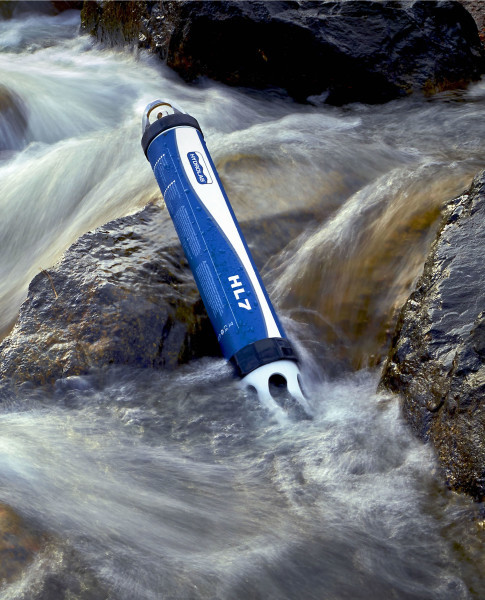

Website last updated `r Sys.time()` by Benjamin Meyer (benjamin.meyer.ak@gmail.com)


```{r setup, include=FALSE}
knitr::opts_chunk$set(echo = TRUE)
knitr::opts_chunk$set(warning = FALSE, message = FALSE)
```

<br>

```{r initialize script, include=FALSE}

# clear environment
rm(list=ls())

#require packages
library(googlesheets)
library(tidyverse)
library(hms)
library(janitor)
library(lubridate)
library(DT)
library(readxl)

# spatial packages
library(leaflet)
library(sp)
library(rgeos)
library(maps)

```





### Summary
Throughout the summer seasons of 2015 and 2016, the Kenai Watershed Forum (https://kenaiwatershed.org/) with funding from Alaska EPSCoR (https://www.alaska.edu/epscor/) collected continuous water quality data in three tributaries of the Kenai River: Beaver Creek, Russian River, and Ptarmigan Creek.  Water quality parameters included:

- Temperature
- Turbidity
- pH
- Dissolved oxygen
- Salinity
- Conductivity

The three tributaries represent a lowland-to-glacial spectrum of watershed types found throughout the Cook Inlet region of Alaska, and exhibit distinct patterns in water quality parameters. 

<br>

***

### Study Locations
```{r}
# make dataframe of coordinates of Hydrolab sites
site <- c("Russian River","Beaver Creek","Ptarmigan Creek")
latitude <- c(60.453,60.5603,60.404833)
longitude <- c(-149.98677,-151.12577,-149.36232)
coords <- data.frame(site,latitude,longitude)

# create map
leaflet(data = coords) %>%
  addTiles() %>%  # Add default OpenStreetMap map tiles
  #fitBounds(-150, 60.04,-149.0, 60.02) %>%
  setView(-150.210169, 60.487694, zoom = 8) %>%
  addMarkers(~longitude, ~latitude, popup = ~as.character(site), label = ~as.character(site))

```


***

### Results

#### Daily mean by year, watershed, and parameter
```{r, height = 10, width = 6}
# Import finalized data series
all_data <- read.csv("output/FinalHydrolabData.csv")

# plot all data

## create facet labels
facet_labs <- c("Conductivity" = "Cond\n(uS/cm)",
                "DO" = "DO\n(%)",
                "pH" = "pH",
                "Temp" = "Temp\n(˚C)",
                "Turbidity" = "Turbidity\n(NTU)")

# plot A
all_data %>%
  group_by(Watershed,Parameter,day,week,month,year)%>%
  summarise(daily_avg = mean(value)) %>%
  ggplot(aes(day,daily_avg, color = Watershed)) +
  geom_point(size = 0.75) +
  theme_bw() +
  facet_grid(Parameter ~ year, scales = "free_y", labeller = labeller(Parameter = facet_labs)) +
  xlab("") +
  ylab("") +
  scale_x_continuous(breaks = c(121,152,182,213,244,275,305),
                     labels = c("May","June","July","Aug","Sept","Oct","Nov")) +
  theme(strip.text = element_text(size = 14, face = "bold")) +
  ggtitle("Daily Mean Data By Parameter, Watershed, and Year - Plot A")


# plot B
all_data %>%
  group_by(Watershed,Parameter,day,week,month,year)%>%
  summarise(daily_avg = mean(value)) %>%
  transform(year = as.factor(year)) %>%
  ggplot(aes(day,daily_avg, color = year)) +
  geom_point(size = 0.75) +
  theme_bw() +
  facet_grid(Parameter ~ Watershed, scales = "free_y", labeller = labeller(Parameter = facet_labs)) +
  xlab("") +
  ylab("") +
  scale_x_continuous(breaks = c(121,152,182,213,244,275,305),
                     labels = c("May","June","July","Aug","Sept","Oct","Nov")) +
  theme(strip.text = element_text(size = 14, face = "bold")) +
  ggtitle("Daily Mean Data By Parameter, Watershed, and Year - Plot B")

```

<br>

#### Turbidity plot
```{r}
# plot
all_data %>%
  group_by(Watershed,Parameter,day,week,month,year)%>%
  summarise(daily_avg = mean(value)) %>%
  transform(year = as.factor(year)) %>%
  filter(Parameter == "Turbidity") %>%
  ggplot(aes(day,daily_avg, color = year)) +
  geom_point(size = 0.75) +
  theme_bw() +
  facet_grid(Watershed ~ ., scales = "free_y", labeller = labeller(Parameter = facet_labs)) +
  xlab("") +
  ylab("") +
  scale_x_continuous(breaks = c(121,152,182,213,244,275,305),
                     labels = c("May","June","July","Aug","Sept","Oct","Nov")) +
  theme(strip.text = element_text(size = 14, face = "bold")) +
  ggtitle("Daily Mean Data, Turbidity")

```
Note differnt y-axes among watersheds

<br>

#### Russian River Turbidity
```{r}
# plot
all_data %>%
  group_by(Watershed,Parameter,day,week,month,year)%>%
  summarise(daily_avg = mean(value)) %>%
  transform(year = as.factor(year)) %>%
  filter(Parameter == "Turbidity",
         Watershed == "Russian River") %>%
  ggplot(aes(day,daily_avg)) +
  geom_point(size = 0.75) +
  theme_bw() +
  facet_grid(year ~ ., scales = "free_y", labeller = labeller(Parameter = facet_labs)) +
  xlab("") +
  ylab("") +
  scale_x_continuous(breaks = c(121,152,182,213,244,275,305),
                     labels = c("May","June","July","Aug","Sept","Oct","Nov")) +
  theme(strip.text = element_text(size = 14, face = "bold")) +
  ggtitle("Daily Mean Data, Russian River Turbidity")

```
Note differnt y-axes among years.  2015 value >200 NTU is very high, but based on the gradual slopes on either side of the event it liklely represent real data.  Maybe a landslide or high rain event associated?

<br>

#### Table of monthly summary values
```{r}
# summarise data
dt <- all_data %>%
  group_by(Watershed,Parameter,year,month) %>%
  summarize(mean = mean(value, na.rm = T),
            max = max(value, na.rm = T),
            min = min(value, na.rm = T),
            sd = sd(value, na.rm = T))

# publish in interactive table
dt %>%
  datatable() %>%
  formatRound(columns=c("mean","max","min","sd"), digits=2)
```

*Note on table: examine one water quality parameter at a time by typing the name in to the search box, e.g., "Turbidity."*

***

<br>


### Methods
Full methods for data QA/QC are described in the document linked here: https://rpubs.com/bmeyer/kenaihydrolabqc

The data presented in this document, which include both 2015 and 2016 data, began with original download files from Hydrolab sondes deployed in summers 2015 and 2016 and employs R code for quality assurance, visualization, and summary.  See Methods document for further details.

QA/QC Methods Summary:

* a.) Visualize original datasets by individual logger, year, and parameter.  Excise visually erroneous data by manually identified date range.
* b.) Average simultaneous values at each site and year when loggers were deployed side-by-side.
* c.) Plot
* d.) Upload data to public repository at NCEAS Knowledge Network for Biocomplexity (https://knb.ecoinformatics.org/) (in progress 10/23/20, not yet arhcived)

Additionally, 2015 data was uploaded to the EPSCoR online data repository at https://catalog.epscor.alaska.edu/dataset/2015-kenai-waterhsed-water-quality-data by Kenai Watershed Forum scientist Jeff Wells.  2015 data at this repository has been QA/QC'd by Jeff Wells.

<br>

### Support 


<br>

 
